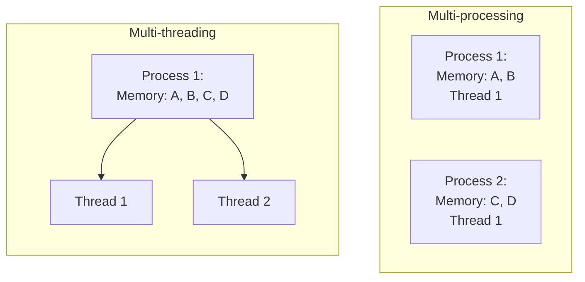

# I just wanted to understand multi-threading and multi-processing in Python

## Install `pyenv` to install multiple python versions
##### Linux
```bash
sudo apt update && sudo apt install -y
curl https://pyenv.run | bash

nano ~/.bashrc
# Inside .bashrc
export PYENV_ROOT="$HOME/.pyenv"
[[ -d $PYENV_ROOT/bin ]] && export PATH="$PYENV_ROOT/bin:$PATH"
eval "$(pyenv init - bash)"
eval "$(pyenv virtualenv-init -)"

# Restart the shell
source ~/.bashrc

# Confirm
pyenv --version
```

##### MacOS
```zsh
brew install pyenv

nano ~/.bashrc
# Inside .bashrc
export PYENV_ROOT="$HOME/.pyenv"
[[ -d $PYENV_ROOT/bin ]] && export PATH="$PYENV_ROOT/bin:$PATH"
eval "$(pyenv init - bash)"
eval "$(pyenv virtualenv-init -)"

# Restart the shell
source ~/.bashrc

# Confirm
pyenv --version
```

## Installing python versions
After `pyvenv` is installed, we can use it to manage different python versions. We can install any version, but we are interested in 2 for comparison:
- Python3.14t: No GIL (supports multi-threading)
- Python3.14: GIL

```bash
# Install the desired version
pyenv install 3.14t
pyenv install 3.14

# Verify installation (list of all installed versions)
pyenv versions
```

## Selecting a Python version for a project
```bash
# Select a global version (python to use in all shells)
pyenv global 3.14.2

# (Preffered) Select a version per project (only use python for a specific project) and create a virtual environment locally
pyenv local 3.14.2
pyenv local 3.14.2t # switch version
python -m venv venv-gil # create virtual envs
python -m venv venv-t
source venv-t/bin/activate
...
deactivate

# Only use that python version for the current shell session
pyenv shell 3.14.2

# Create a virtual environment for each version
pyenv virtualenv 3.14.2t venv-t
pyenv virtualenv 3.14.2 venv-gil
pyenv activate venv-t

source deactivate
pyenv activate venv-gil

# Revise
python --version

# List virtual environments
pyenv virtualenvs

# Delete a virtual environment
pyenv uninstall venv-gil
pyenv uninstall venv-t
```

## Run the comparison
This shows the differences for CPU tasks:
```bash
python cpu-comparison.py
```

For I/O differences use the following script instead (works same with GIL and without GIL):
```bash
python io-comparison.py
```

## What is the difference between multi-threading and multi-processing in Python?

### TL;DR
**Multithreading**: Multiple workers in the same office (shared space)  
**Multiprocessing**: Multiple workers in separate offices (separate spaces)

### A little story to understand the concepts (multi-threading, multi-processing, GIL)

A process is a running program with its own memory space.

- Has its own memory (variables, data)
- Isolated from other processes
- Can crash without affecting others
- Heavier to create (more resources)

Like a house, it's your personal space. If for some reason it breaks down or catches fire, it only affects you (not your neighbours).
- You can make lunch in 20 minutes
- Clean the house in 3 hours
- Take out the trash in 5 minutes

You took a total of 3 hours and 25 minutes to complete the process, but hey, you are alone (isolated), no one is bothering you, if you forget to do something it only affects your house (fault tolerance), etc.

Now imagine that there is a hole in the pavement, it affects all your neighbours (and you), so you collectively call the government for it to be solved. However, the government responds when it pleases, so you have to call them again and again. Now, if all of you, from your own houses, used your own telephone to call the government, it makes the process faster than if you were the only one calling and waiting for a response.
- That will be multi-processing.

A thread is a path of execution within a process.

- Shares memory with other threads in the same process
- Lightweight (easy to create)
- If one crashes, it can affect the whole process
- Faster to create

Now, instead of owning a house, you rent a house, so you have roommates with which you share the kitchen, bathroom, etc. If someone decides to break the door, it affects everyone in the house (including you). However, you can divide chores.
- One roommate can make lunch in 20 minutes.
- One can clean half the house in 1.5 hours.
- One can clean the other half of the house in 1.5 hours.
- You can take out the trash in 5 minutes.

You might be thinking that it took the same time (3 hours and 25 minutes), and you won't be wrong, but neither will you be right. In essence, it took a combined effort of that time, but since each of you did it at the same time, separately, at most it took 1.5 hours (the longest time for 1 chore). That's the wall-clock time (the actual time that passed while you were all working in parallel).

Now imagine that there is a hole in the pavement, but it's in the entrance of your house, so it only affects your roommates (and you). You collectively call the government for it to be solved, however the government responds when it pleases, so you have to call them again and again. Now, if all of you, from your own rooms, used your own telephone to call the government, it makes the process faster than if you were the only one calling and waiting for a response (assuming each of you has a telephone inside the room)
- But what if there is only 1 telephone? You simply don't have enough money or space for a telephone in each room (that's where you know when to use multi-processing instead of multi-threading, when the shared resources are not enough for all the threads)
- But what if your landlord only allows you to have 1 telephone even though you can have more? (then it will basically be the same as calling on your own, one at a time. Your landlord is what in Python is called the "GIL" - the Global Interpreter Lock. It's like a rule that says only one person can use the telephone at a time, even though you have multiple roommates who could have one)
  - That happens in the normal Python installations, but since Python 3.13+ (with the `--disable-gil` build flag) and Python 3.14t, you can have a free-threading build that removes the GIL.


### Visual comparison



### In Python code

#### Multithreading example:

```python
import threading

shared_list = []  # All threads share this!

def worker(thread_id):
    shared_list.append(thread_id)  # All threads can modify this
    print(f"Thread {thread_id} added to shared list")

# Create threads
threads = []
for i in range(4):
    t = threading.Thread(target=worker, args=(i,))
    threads.append(t)
    t.start()

for t in threads:
    t.join()

print(shared_list)  # [0, 1, 2, 3] - all threads modified same list!
```

#### Multiprocessing example:

```python
import multiprocessing

def worker(process_id):
    # Each process has its own copy of this list!
    local_list = []
    local_list.append(process_id)
    print(f"Process {process_id} has list: {local_list}")
    return local_list

# Create processes
processes = []
results = []
for i in range(4):
    p = multiprocessing.Process(target=worker, args=(i,))
    processes.append(p)
    p.start()

for p in processes:
    p.join()

# Each process had its own separate list!
```

### Key differences

| Aspect              | Multithreading              | Multiprocessing                |
| ------------------- | --------------------------- | ------------------------------ |
| **Memory**          | Shared (same memory space)  | Separate (each has own memory) |
| **Speed to create** | Fast (~0.001ms)             | Slow (~10-100ms)               |
| **Memory usage**    | Low (shared)                | High (duplicated)              |
| **Data sharing**    | Easy (direct access)        | Hard (need queues/pipes)       |
| **Isolation**       | Low (one crash affects all) | High (isolated)                |
| **Python GIL**      | Shared (one GIL)            | Separate (each has own GIL)    |

### The Python GIL problem

#### Multithreading with GIL:
```python
# All threads share ONE GIL
# Only one thread can run Python code at a time
# Even on 4 CPU cores, only 1 thread runs at a time
# Result: NO true parallelism for CPU-bound tasks
```

#### Multiprocessing:
```python
# Each process has its OWN GIL
# 4 processes = 4 GILs = 4 threads can run simultaneously
# Result: TRUE parallelism for CPU-bound tasks
```

### A Real-world analogy from ChatGPT

#### Multithreading = restaurant with multiple waiters
- All waiters share the same kitchen (shared memory)
- Only one waiter can use the kitchen at a time (GIL)
- But waiters can take orders while others wait (I/O parallelism)
- If one waiter crashes, restaurant might close (shared process)

#### Multiprocessing = multiple restaurants
- Each restaurant has its own kitchen (separate memory)
- All restaurants can cook simultaneously (true parallelism)
- If one restaurant closes, others keep running (isolation)
- But harder to share ingredients between restaurants (need IPC)


### Summary

**Multithreading:**
- Multiple threads in one process
- Share memory
- Fast to create
- Good for I/O-bound tasks
- Limited by GIL for CPU-bound tasks

**Multiprocessing:**
- Multiple separate processes
- Separate memory
- Slower to create
- Good for CPU-bound tasks
- True parallelism (each process has its own GIL)

**Simple rule:**
- I/O waiting (files, network, database) → Multithreading
- CPU computation (math, processing) → Multiprocessing

Remember: threads are roommates (share everything), processes are neighbors (separate houses).

## Why is multi-threading (with GIL) slower than single-threaded?
With the GIL, multithreading can be slower than single-threaded due to overhead:

1. GIL lock overhead
- Each thread must acquire and release the GIL
- This adds lock acquisition/release overhead on every switch
- Single-threaded has zero lock overhead

2. Context switching cost
- The GIL switches threads every ~5ms or after a set number of bytecode instructions
- Each switch involves:
  - Saving/restoring CPU state
  - Potential CPU cache invalidation (cache misses when switching back)
  - Thread scheduling decisions

3. Thread management overhead
- Creating threads: `threading.Thread()` creation
- Starting threads: `thread.start()` system calls
- Joining threads: `thread.join()` synchronization
- Single-threaded has none of this


4. Cache performance degradation
- Frequent thread switches cause CPU cache misses
- Each thread's data may be evicted from cache
- Single-threaded keeps everything in cache

5. False parallelism overhead
- The OS thinks threads can run in parallel, but the GIL prevents it
- You get the overhead of parallelism without the benefit

### Why multiprocessing is faster in this case?

- Each process has its own GIL (no contention)
- True parallelism across CPU cores
- Process creation overhead (~0.04s) is small compared to the speedup

With GIL:
- Single-threaded: fastest (no overhead)
- Multithreading: slower (overhead without parallelism)
- Multiprocessing: fastest (true parallelism)

Therefore, in traditional Python, multiprocessing is preferred for CPU-bound tasks. The GIL makes multithreading worse than single-threaded for CPU-bound work.

## Why Multithreading exists in Traditional Python? Is it useful?
Multithreading is useful in Python, but not for CPU-bound tasks. It helps with I/O-bound work because the GIL is released during I/O.

1. I/O-bound tasks

The GIL is released during I/O operations, so threads can run in parallel:

```python
import threading
import requests
import time

def fetch_url(url):
    response = requests.get(url)  # GIL released during network I/O!
    return response.status_code

# Single-threaded: 4 seconds (1 sec per request)
start = time.time()
for url in urls:
    fetch_url(url)
# Total: ~4 seconds

# Multithreaded: ~1 second (all requests in parallel)
threads = []
for url in urls:
    t = threading.Thread(target=fetch_url, args=(url,))
    t.start()
    threads.append(t)
for t in threads:
    t.join()
# Total: ~1 second
```

Examples:
- Web scraping (HTTP requests)
- Database queries
- File I/O (reading/writing files)
- API calls
- Network operations

2. Responsive GUIs

Keep the UI responsive while doing background work:

```python
import threading
import tkinter as tk

def long_running_task():
    # This runs in background thread
    # UI stays responsive!
    time.sleep(10)  # Simulate work
    result = do_something()
    update_ui(result)

# Start task in background thread
thread = threading.Thread(target=long_running_task)
thread.start()
# UI remains responsive!
```

3. Concurrent I/O operations

Handle multiple I/O operations simultaneously:

```python
# Download 100 files concurrently
def download_file(url):
    # GIL released during download
    urllib.request.urlretrieve(url, filename)

threads = [threading.Thread(target=download_file, args=(url,)) 
           for url in urls]
for t in threads:
    t.start()
# All downloads happen in parallel!
```

4. Producer-consumer patterns

One thread produces data, another consumes it:

```python
import queue
import threading

def producer(q):
    for i in range(100):
        data = fetch_data()  # I/O operation
        q.put(data)

def consumer(q):
    while True:
        data = q.get()
        process_data(data)  # I/O operation
        q.task_done()

q = queue.Queue()
threading.Thread(target=producer, args=(q,), daemon=True).start()
threading.Thread(target=consumer, args=(q,), daemon=True).start()
```

### Real-world examples

Web server handling requests
```python
# Each request is I/O-bound (waiting for database, files, etc.)
def handle_request(request):
    data = db.query(...)  # I/O - GIL released
    file = open(...)      # I/O - GIL released
    return render_template(...)

# Thread pool handles multiple requests concurrently
```

### When NOT to use multithreading

- CPU-bound tasks (use multiprocessing)
- Tasks that need true parallelism (use multiprocessing)
- Tasks with shared mutable state (complex synchronization needed)

### Why is the GIL released? Why is it not always blocking?
The GIL makes that only one thread can run Python code at a time. "Released" means the thread temporarily gives up the power of running code, thus releasing the GIL, so another thread can run python code.
- During I/O, the thread is waiting (not using the CPU), so it releases the GIL and other threads can run.
- In other words, during I/O, the thread is waiting (blocked), not running Python bytecode. Since it's not modifying Python objects, there's no risk of race conditions, so the GIL can be released.

Example:
```python
file = open('data.txt', 'r')  # Thread releases GIL here!
# While waiting for disk, other threads can run Python code
data = file.read()  # Still waiting for disk - GIL still released
file.close()
# GIL reacquired when I/O completes
```

Example 2:
```python
import threading
import time
import requests
import multiprocessing

def fetch_url(url, results):
    print(f"Thread {threading.current_thread().name} starting")
    
    # This is I/O - GIL is RELEASED here!
    response = requests.get(url)  # Waiting for network...
    # While waiting, other threads can run!
    
    print(f"Thread {threading.current_thread().name} done")
    results.append(response.status_code)

# All 4 threads can make requests simultaneously
# Because GIL is released during network wait time
def main():
    url = "https://www.google.com/"
    results_thread = []
    results_single = []

    # # -------------- Multi Threaded --------------- #
    threads = []
    start = time.perf_counter()
    for i in range(4):
        t = threading.Thread(target=fetch_url, args=(url, results_thread))
        t.start()
        threads.append(t)

   # join() is used to wait for threads to finish
   # if we dont wait, the program might exit early, so we will not see results
   # results = []
   # Try and comment out the next 2 lines and see for yourself
    for t in threads:
        t.join()

    end = time.perf_counter()
    print("Time taken: ", end - start)

    # -------------- Single threaded --------------- #
    start = time.perf_counter()
    for i in range(4):
        fetch_url(url, results_single)
    end = time.perf_counter()
    print("Time taken: ", end - start)

    print("\nResults (threads):", list(results_thread))
    print("Results (single):", results_single)

if __name__ == "__main__":
    main()

```

## Why not use multiprocessing for I/O?

You could, but multithreading is often better for I/O:

| Aspect          | Multithreading       | Multiprocessing     |
| --------------- | -------------------- | ------------------- |
| Overhead        | Low (~1-10μs)        | High (~1-10ms)      |
| Memory          | Shared               | Separate (more RAM) |
| Data sharing    | Easy (shared memory) | Hard (need IPC)     |
| I/O performance | Same (GIL released)  | Same                |
| Best for I/O    | Adequate             | Overkill            |


## Multithreading vs Multiprocessing (No GIL)

### Multithreading (no GIL) is typically faster for CPU-bound tasks

Reasons:
1. Lower overhead
- Thread creation: ~1–10 microseconds
- Process creation: ~1–10 milliseconds (100–1000x slower)
- Threads share memory space; processes require separate memory spaces

2. Faster context switching
- Threads: lightweight context switches (just CPU registers)
- Processes: heavier context switches (full memory space swap)

3. Better memory efficiency
- Threads: share memory (lower total memory usage)
- Processes: separate memory spaces (higher memory usage, more cache misses)

4. Easier data sharing
- Threads: direct memory access (no serialization needed)
- Processes: require IPC (queues, pipes, shared memory) with serialization overhead

### When multiprocessing might still be better

1. Very CPU-intensive workloads
   - Process isolation can reduce cache contention
   - Each process gets dedicated CPU cache

2. Fault tolerance
   - Process crash doesn't kill others
   - Thread crash can affect the whole process

3. Memory isolation
   - Processes can't accidentally corrupt each other's memory
   - Better for security/isolation


For CPU-bound tasks without GIL:
- Multithreading is usually faster due to lower overhead
- Multiprocessing is slower but offers better isolation
- The performance gap narrows with longer-running tasks (overhead becomes less significant)

For I/O-bound tasks:
- Multithreading is almost always better (even with GIL, since I/O releases the GIL)

Bottom line: Without GIL, multithreading typically wins for CPU-bound tasks due to lower overhead, unless you need process-level isolation.

## What is the GIL? Why we need it?
The Global Interpreter Lock (GIL) is a mutex (lock) that allows only one thread to execute Python bytecode at a time, even on multi-core systems.

### TL;DR
The GIL exists because:
1. It protects Python's memory management from race conditions
2. It simplifies C extension development
3. It was a pragmatic choice when Python was created

The cost: CPU-bound Python code can't use multiple cores effectively with threads, which is why multiprocessing is preferred for CPU-bound work.

The GIL is a compromise: it simplifies the implementation and prevents many bugs, but limits parallelism for CPU-bound code.

### Why does it exist?

1. Memory management safety
Python uses reference counting for garbage collection:
```python
# Every object has a reference count
x = [1, 2, 3]  # ref_count = 1
y = x          # ref_count = 2
del x          # ref_count = 1
# When ref_count = 0, object is freed
```

Without the GIL, multiple threads could modify reference counts simultaneously, causing:
- Race conditions
- Memory corruption
- Double-free bugs
- Use-after-free bugs

The GIL serializes access to Python objects, preventing these issues.

2. C extension compatibility
Many Python libraries are C extensions (NumPy, Pandas, etc.). The GIL provides a simple model:
- C extensions can assume single-threaded execution
- Easier to write thread-safe C code
- Prevents complex locking in every C extension

3. Historical reasons
- Python was designed in the 1990s when multi-core CPUs were rare
- Single-threaded performance was the priority
- The GIL simplified the implementation

### How the GIL works

```python
# Thread 1: Running Python code
# Thread 2: Waiting for GIL
# Thread 3: Waiting for GIL

# GIL switches every:
# - ~5 milliseconds (time slice)
# - After ~100 bytecode instructions (tick count)
# - On I/O operations (releases GIL)
```

### The GIL trade-offs

### Advantages
- Simple memory management (no complex locking)
- Thread-safe C extensions
- Fast single-threaded performance
- Prevents many concurrency bugs

### Disadvantages
- No true parallelism for CPU-bound Python code
- Multiple threads can't use multiple CPU cores effectively
- CPU-bound multithreading is often slower than single-threaded

### When the GIL is released?

The GIL is released during I/O operations:
- File I/O (`open()`, `read()`, `write()`)
- Network I/O (`socket.recv()`, `requests.get()`)
- `time.sleep()`
- Some NumPy operations (releases GIL internally)

This is why multithreading works well for I/O-bound tasks.

## What is the `if __name__ == "__main__":`?

It checks whether the script is being run directly (not imported). It prevents code from running when the module is imported.

### How Python imports work

When Python imports a module, it executes all top-level code in that file.

#### Without `if __name__ == "__main__":`

```python
# script.py
print("This runs when imported!")
def my_function():
    return "Hello"

# This runs even when imported!
print("This also runs when imported!")
my_function()

# If imported:
# import script  # Prints both messages!
```

#### With `if __name__ == "__main__":`

```python
# script.py
print("This runs when imported!")
def my_function():
    return "Hello"

# This ONLY runs when script is executed directly
if __name__ == "__main__":
    print("This only runs when executed directly!")
    my_function()

# If imported:
# import script  # Only prints first message
# If executed:
# python script.py  # Prints all messages
```

### What is `__name__`?

`__name__` is a special variable that Python sets automatically:

- When you run a file directly: `__name__ == "__main__"`
- When you import a file: `__name__ == "filename"` (the module name)

```python
# my_script.py
print(f"__name__ is: {__name__}")

if __name__ == "__main__":
    print("Running directly!")
```

```bash
$ python my_script.py
__name__ is: __main__
Running directly!

$ python -c "import my_script"
__name__ is: my_script
# "Running directly!" is NOT printed
```

### Why it's critical for multiprocessing

Without this guard, multiprocessing can cause infinite process spawning.

#### The problem (without the guard):

```python
# bad_multiprocessing.py
import multiprocessing

def worker():
    print("Worker running!")

# This runs when imported!
process = multiprocessing.Process(target=worker)
process.start()
process.join()
```

What happens:
1. You run: `python bad_multiprocessing.py`
2. Python creates a process
3. The new process imports the module (to get the `worker` function)
4. Importing runs the top-level code again
5. Creates another process
6. That process imports the module...
7. Infinite loop of process creation

#### The solution (with the guard):

```python
# good_multiprocessing.py
import multiprocessing

def worker():
    print("Worker running!")

# This ONLY runs when executed directly
if __name__ == "__main__":
    process = multiprocessing.Process(target=worker)
    process.start()
    process.join()
```

What happens:
1. You run: `python good_multiprocessing.py`
2. `__name__ == "__main__"` is True → creates process
3. New process imports the module
4. `__name__ == "good_multiprocessing"` (not `"__main__"`)
5. Guard prevents creating another process
6. Process runs `worker()` and exits

### Visual explanation

#### Without guard (infinite processes):

```
Main Process:
  ├─ Runs: process.start()
  ├─ Creates Child Process 1
  │   ├─ Imports module (runs top-level code!)
  │   ├─ Runs: process.start()  ← PROBLEM!
  │   ├─ Creates Child Process 2
  │   │   ├─ Imports module (runs top-level code!)
  │   │   ├─ Runs: process.start()  ← PROBLEM!
  │   │   └─ Creates Child Process 3
  │   │       └─ ... INFINITE LOOP!
```

#### With guard (safe):

```
Main Process:
  ├─ __name__ == "__main__" → True
  ├─ Runs: process.start()
  └─ Creates Child Process 1
      ├─ Imports module
      ├─ __name__ == "good_multiprocessing" → False
      ├─ Guard prevents process.start()
      └─ Just runs worker() function
```

### Benefits

1. Prevents infinite process spawning in multiprocessing
2. Allows importing functions without side effects
3. Makes code reusable (can import without running main code)
4. Standard Python practice